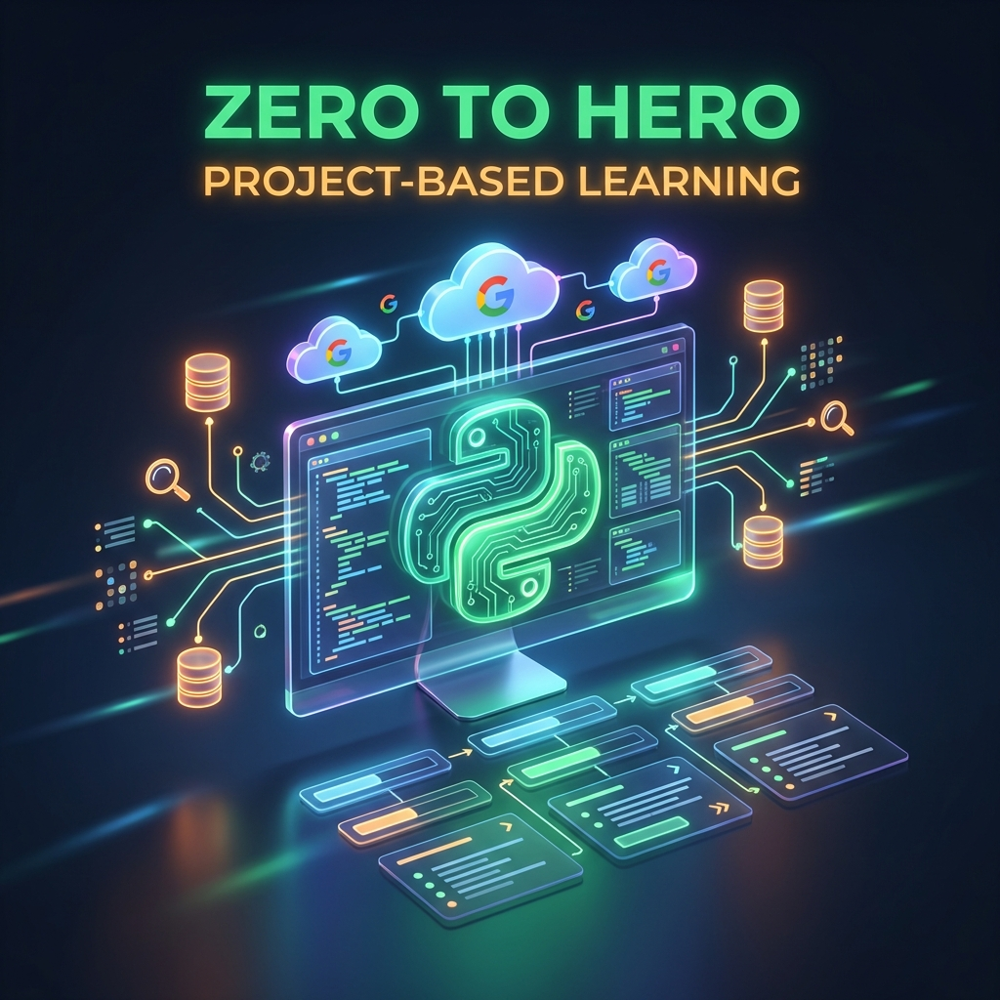

# 🐍 Python 程式設計入門：打造你的貪食蛇遊戲
# Programming for Information Management: Zero to Hero



[](https://www.python.org/)
[](https://colab.research.google.com/)
[](LICENSE)

## 📖 課程簡介 (About the Course)

本課程專為**資訊管理 (Information Management)** 背景學生設計，採用 **PBL (Project-Based Learning)** 專案導向學習法。擺脫枯燥的語法背誦，我們從第一天開始就以「打造貪食蛇遊戲」為最終目標，將 Python 的核心觀念（變數、迴圈、函式、物件導向）融入實作中。

### 核心特色 (Key Features)
*   **全雲端開發**: 100% 使用 Google Colab，無需安裝環境，隨時隨地寫程式。
*   **做中學 (Learning by Doing)**: 包含 **480 個實作練習 (Labs)**，確保觀念轉化為肌肉記憶。
*   **完整詳解**: 提供 Instructor Solution Manuals，包含每週 5W1H 深度分析與程式碼解析。
*   **專案導向**: 最終產出完整的 Pygame 貪食蛇遊戲，從邏輯設計到視覺優化。

---

## 🗺️ 課程地圖 (Curriculum Roadmap)

我們將 16 週的旅程分為四個階段，循序漸進地從新手變身為開發者。

| 階段 | 週次 | 主題 (Focus) | 關鍵技能 (Skills) |
| :--- | :--- | :--- | :--- |
| **Phase 1** | W01-W04 | **蹲馬步 (Foundation)** | 變數、邏輯判斷、迴圈結構、計算思維 |
| **Phase 2** | W05-W08 | **學招式 (Data Structures)** | 列表、字典、集合、函式設計、模組化 |
| **Phase 3** | W09-W12 | **拿武器 (Tools & OOP)** | 檔案處理、例外控制、**物件導向 (Class)** |
| **Phase 4** | W13-W16 | **上戰場 (Final Project)** | 遊戲演算法、碰撞偵測、UI/UX 優化、成果發表 |

---

## 📂 教學資源 (Teaching Resources)

本儲存庫包含完整的教學與學習資源：

### 📘 實作題庫 (Lab Manuals)
*   [Vol.1: 基礎語法 (W1-W4)](Teaching_Resources/python_lab_manual_vol1.md)
*   [Vol.2: 資料結構 (W5-W8)](Teaching_Resources/python_lab_manual_vol2.md)
*   [Vol.3: 進階觀念 (W9-W12)](Teaching_Resources/python_lab_manual_vol3.md)
*   [Vol.4: 專案開發 (W13-W16)](Teaching_Resources/python_lab_manual_vol4.md)

### 📕 解答手冊 (Solution Manuals)
*包含完整程式碼與 5W1H 教學分析，僅供講師參考。*
*   [Vol.1 Solutions](Teaching_Resources/python_solution_manual_vol1.md)
*   [Vol.2 Solutions](Teaching_Resources/python_solution_manual_vol2.md)
*   [Vol.3 Solutions](Teaching_Resources/python_solution_manual_vol3.md)
*   [Vol.4 Solutions](Teaching_Resources/python_solution_manual_vol4.md)

---

## 🚀 快速開始 (Getting Started)

1.  **Clone 此專案**:
    ```bash
    git clone https://github.com/your-username/python-snake-course.git
    ```
2.  **打開課程大綱**: 閱讀 [Course Curriculum](python_course_curriculum.md) 了解詳細進度。
3.  **開始練習**: 進入 [Google Colab](https://colab.research.google.com/)，複製 Lab Manual 中的題目開始 Coding！

---

## 🐍 最終專案預覽 (Final Project)

在第 16 週，你將能夠獨立完成一個具備以下功能的遊戲：
*   ✅ **流暢的移動控制** (佇列演算法)
*   ✅ **隨機食物生成** (座標防重疊邏輯)
*   ✅ **碰撞偵測系統** (自我碰撞與邊界判定)
*   ✅ **現代化計分板** (最高分持久化儲存)

> *"Don't just play games, make them."*

---

## 📝 版權資訊 (License)

本課程教材採用 [MIT License](LICENSE) 開源授權，歡迎教育單位自由使用與修改。

---
*Created by [Your Name/Org]*
